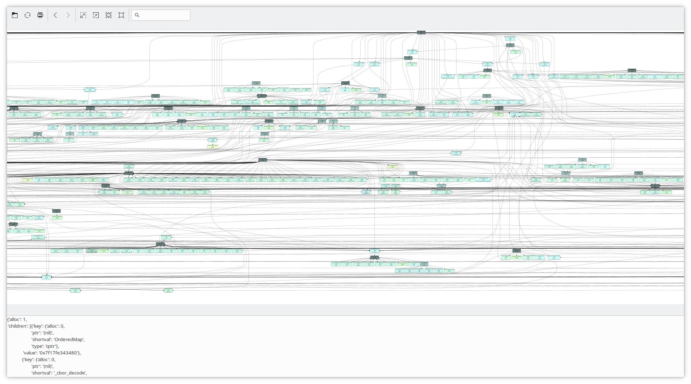
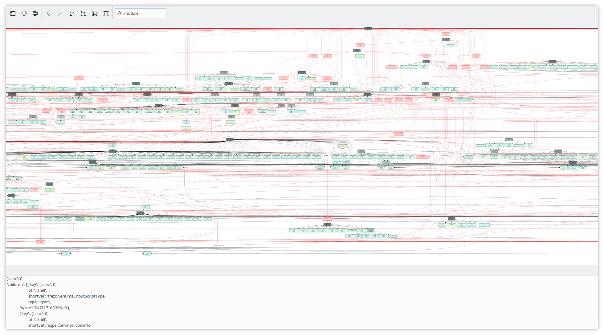
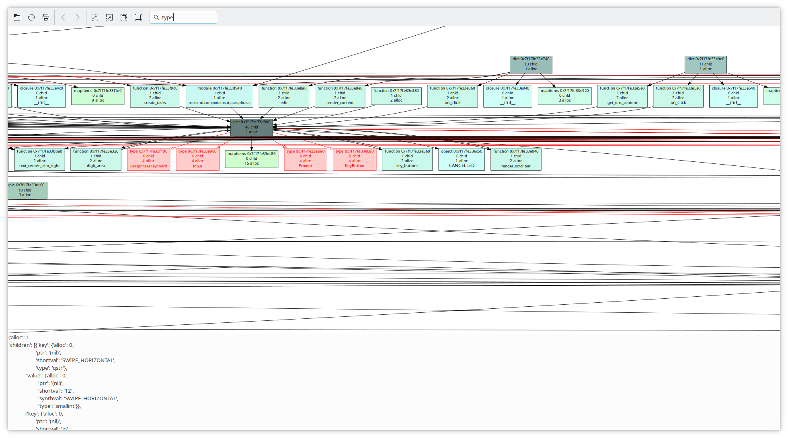

# Visualizer for micropython Trezor T memory dumps

This interactive visualizer of memory allocated by micropython allocator from
emulator. There is/has been a switch to make emulator dump this out.

Since a lot of the code has been rewritten in Rust, it's less useful, but the
display, pruning of children, and having general idea how memory profile (as
opposed to CPU profile) looks like is interesting. Thus tool was never
completely finished and documented, but may show ho to similar visualization in
python3 + xdot.

Most notably, CPU profiles tend to be deep, whereas due to dicts RAM profiles
are wide, but shallow, so it was not easy to cut off branches to save memory
with non-compacting garbale collector.

Each node is assigned color based on number of children and how many blocks it
allocates itself, which is 2-D color scale, but it was hard to make it visually
readable (can't use just 2 of HSV, RGB, you'll end up with unreadable text on
black and so on).

## Some examples

To give an idea how much just a program on 128 kB RAM can fragment, and due to
references can't be easily unallocated/garbage collected, here are few selected
screenshots below (more in screenshots directory).

### Toplevel bird's view

### Toplevel with search for modules

### Zoom view highligted types.

